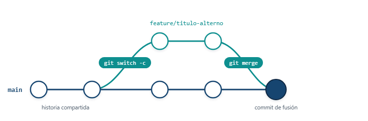

# Título 1
## Título 2
### Título 3
#### Título 4


## Negrillas
**Texto en negrita**

__Texto en negrita__

## Texto en cursiva
*Texto en cursiva*

_Texto en cursiva_

## Listas
- Item 1
- Item 2 
- Item 3

## Listas numeradas
1. Item 1
2. Item 2
3. Item 3

## Citas
> Esta es una cita


## Código
```python
print("Hola, mundo!")
```

```cpp
#include <iostream>

int main() {
    std::cout << "Hola, mundo!" << std::endl;
    return 0;
}
```

```bash
echo "Hola, mundo!"
```

## Código en línea
La función `print()` se utiliza para mostrar texto en la consola.

## Enlaces
[Google](https://www.google.com)

## Imágenes




## Tablas
| Encabezado 1 | Encabezado 2 | Encabezado 3 |
|--------------|--------------|--------------|
| Columna 1 | Columna 2 | Columna 3 |
| Columna 1 | Columna 2 | Columna 3 |

## Ecuaciones
Ecuación de la física: $E = mc^2$

$$ax^2 + bx + c = 0$$

$$\frac{-b\pm \sqrt{b^2-4ac}}{2a}$$

## Referencias
>[Referencia 1](https://www.example.com)
>[Referencia 2](https://www.example.com)
>Guía de estilo de Markdown: [Markdown Guide](https://www.markdownguide.org/)